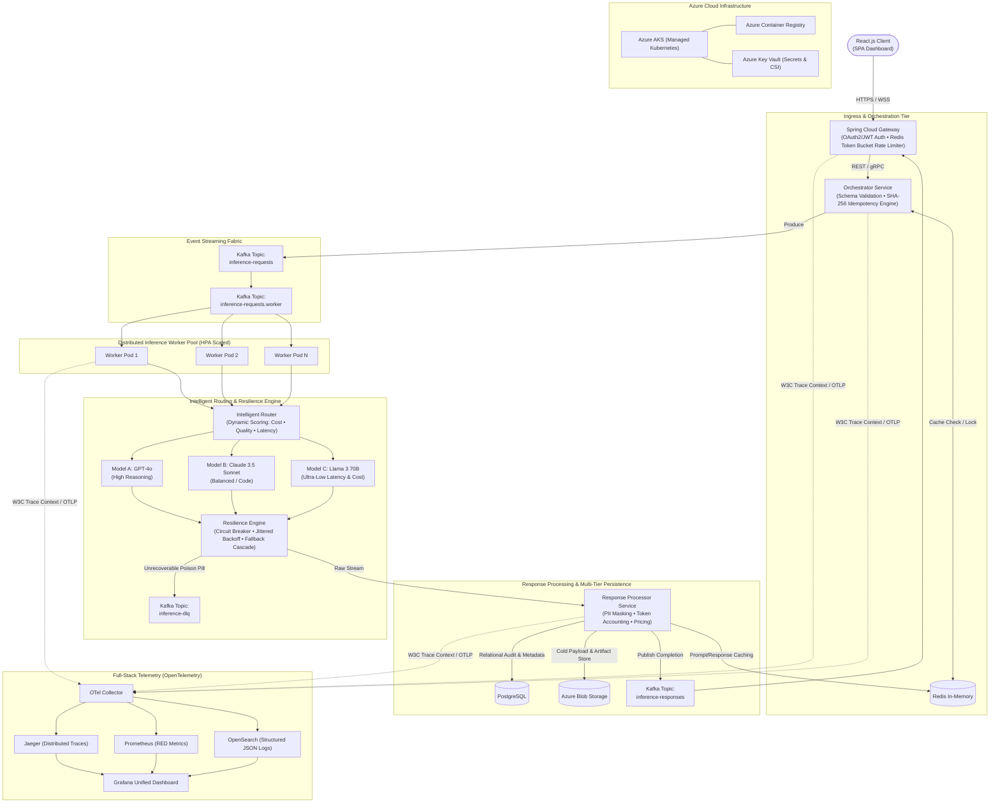
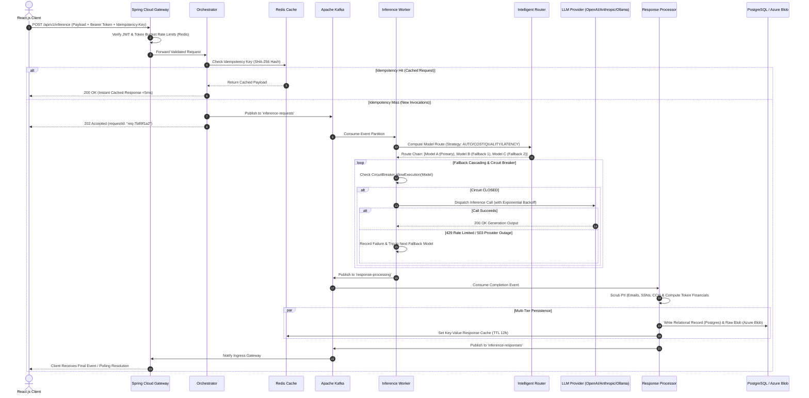

# ScaleGen — Enterprise GenAI Gateway & Intelligent LLM Router

[](https://github.com/kamran-asif/ScaleGen)
[](https://openjdk.org/)
[](https://spring.io/projects/spring-boot)
[](https://kafka.apache.org/)
[](https://opentelemetry.io/)
[](https://react.dev/)
[](https://kubernetes.io/)
[](LICENSE)

**ScaleGen** is an enterprise-grade, distributed microservices platform engineered for high-throughput, fault-tolerant Generative AI request orchestration and intelligent LLM routing. 

Built on **Spring Boot 3**, **Apache Kafka**, **PostgreSQL**, **Redis**, and **React 18**, ScaleGen provides unified access to multi-vendor Foundation Models (OpenAI, Anthropic, Meta/Ollama) with automatic failover, real-time cost-latency-quality arbitration, cryptographic idempotency, PII scrubbing, and end-to-end distributed tracing.

---

## Table of Contents

1. [Architectural Overview](#architectural-overview)
2. [Visual Architecture Topology](#visual-architecture-topology)
3. [End-to-End Sequence Flow](#end-to-end-sequence-flow)
4. [Core Architectural Pillars](#core-architectural-pillars)
   - [Distributed Gateway & Ingress](#1-distributed-gateway--ingress)
   - [Idempotency & Orchestration Engine](#2-idempotency--orchestration-engine)
   - [Event-Driven Streaming Fabric](#3-event-driven-streaming-fabric)
   - [Intelligent LLM Router](#4-intelligent-llm-router)
   - [Resilience & Fault-Tolerance Circuitry](#5-resilience--fault-tolerance-circuitry)
   - [Sanitization & Multi-Tier Persistence](#6-sanitization--multi-tier-persistence)
   - [Unified Observability & Telemetry](#7-unified-observability--telemetry)
5. [Microservices Catalog](#microservices-catalog)
6. [Intelligent Routing Engine Matrix](#intelligent-routing-engine-matrix)
7. [API Specification & Examples](#api-specification--examples)
8. [Local Development Quickstart](#local-development-quickstart)
9. [Production Deployment (Azure AKS)](#production-deployment-azure-aks)
10. [Repository Structure](#repository-structure)

---

## Architectural Overview

```
                         React.js
                            │
                            ▼
                 Spring Cloud Gateway
                 Auth • Rate Limit
                            │
                            ▼
                     Orchestrator
              Validation • Idempotency
                            │
                            ▼
                          Kafka
                            │
             ┌──────────────┼──────────────┐
             ▼              ▼              ▼
          Worker 1       Worker 2       Worker N
             └──────────────┼──────────────┘
                            ▼
                   Intelligent Router
                  Cost • Quality • Latency
                       /     |      \
                      ▼      ▼       ▼
                   Model A Model B Model C
                      \      |       /
                       └──────┼─────┘
                              ▼
                         LLM Provider
                              │
                    ┌─────────┴─────────┐
                    │ Retry             │
                    │ Fallback          │
                    │ Circuit Breaker   │
                    │ DLQ               │
                    └─────────┬─────────┘
                              ▼
                     Response Processor
                              │
              ┌───────────────┼───────────────┐
              ▼               ▼               ▼
         PostgreSQL         Redis        Azure Blob
                             
                 ─── Observability ───
                              │
                     OpenTelemetry
                              │
          ┌───────────────────┼──────────────────┐
          ▼                   ▼                  ▼
       Jaeger             Prometheus         OpenSearch
       Traces              Metrics               Logs
          └───────────────────┼──────────────────┘
                              ▼
                           Grafana

                 ─── Cloud Infrastructure ───
                              │
                         Azure AKS
                              │
                    ┌─────────┴─────────┐
                    ▼                   ▼
                   ACR             Key Vault
```

---

## Visual Architecture Topology



---

## End-to-End Sequence Flow



---

## Core Architectural Pillars

### 1. Distributed Gateway & Ingress
* **Authentication & Authorization**: Validates incoming OAuth2/OIDC JWT tokens, extracting tenant identities, user scopes, and subscription entitlement tiers.
* **Token Bucket Rate Limiting**: Distributed, low-latency rate limiting enforced via Redis hashes. Prevents noisy-neighbor saturation by throttling on both:
  * **RPM (Requests Per Minute)**
  * **TPM (Tokens Per Minute)**

### 2. Idempotency & Orchestration Engine
* **Cryptographic Request Fingerprinting**: Generates deterministic SHA-256 digests over `userId + prompt + modelParameters + idempotencyKey`.
* **Zero-Compute Short Circuiting**: If an identical request was fulfilled within the deduplication window, ScaleGen bypasses the LLM compute grid entirely, returning the cached payload in $<5\text{ms}$.
* **Guardrail & Prompt Enrichment**: Sanitizes input schemas, bounds generation limits (`max_tokens`, `temperature`, `top_p`), and injects organization system directives.

### 3. Event-Driven Streaming Fabric
* **Decoupled Architecture**: Eliminates HTTP thread starvation during extended generative completions by buffering requests in **Apache Kafka**.
* **Topic Partitioning Strategy**: Requests are keyed by `tenantId` or `userId` to ensure partition-level ordering and distributed consumer concurrency across worker groups.
* **Dead Letter Queue (DLQ)**: Poison pills or permanent upstream rejections are systematically pushed to `inference-dlq` alongside fault telemetry for diagnostic replay.

### 4. Intelligent LLM Router
The router dynamically optimizes model selection using a weighted multi-criteria decision matrix:

$$\text{Score} = w_c \cdot C_{\text{est}} + w_l \cdot L_{\text{p99}} + w_q \cdot (1 - Q_{\text{model}}) + w_a \cdot (1 - A_{\text{health}})$$

* **`AUTO` Mode**: Evaluates prompt linguistic complexity and semantic length. Simple queries (e.g. classification, translation) route to fast, cheap models; complex multi-step reasoning queries dynamically route to Frontier models.
* **`COST` Mode**: Aggressively minimizes token expenditure by selecting the lowest cost-per-token provider matching minimum quality thresholds.
* **`QUALITY` Mode**: Directs traffic to Tier-1 models (e.g., GPT-4o, Claude 3.5 Sonnet) prioritized for accuracy and instruction-following.
* **`LATENCY` Mode**: Prioritizes lowest Time-To-First-Token (TTFT) and P99 latency models (e.g., Llama 3 70B, Mistral Small).

### 5. Resilience & Fault-Tolerance Circuitry
* **Circuit Breaker State Machine**: Monitors rolling error rates per model endpoint. When failures exceed threshold ($>3$ consecutive or $>30\%$ window), the breaker transitions to `OPEN`, immediately shielding the failing provider and diverting traffic to fallbacks.
* **Exponential Backoff with Full Jitter**: Retries transient $429$ (rate-limited) and $5xx$ errors with randomized backoff delays to eliminate thundering herds:
  $$t_{\text{sleep}} = \text{random}(0, \min(t_{\text{max}}, t_{\text{base}} \cdot 2^{\text{attempt}}))$$
* **Active Fallback Cascading**: If Model A fails or times out, the engine seamlessly invokes Model B $\rightarrow$ Model C in real-time while annotating telemetry logs with the full fallback traversal.

### 6. Sanitization & Multi-Tier Persistence
* **PII Redaction Engine**: High-performance regex pipeline scrubbing sensitive data (Emails, Social Security Numbers, Credit Card patterns, IPv4 addresses) from completion streams before client delivery.
* **Tiered Storage Architecture**:
  * **PostgreSQL**: ACID-compliant transactional store for audit trails, token accounting, latency breakdowns, and request tracking.
  * **Redis**: Microsecond in-memory key-value cache for hot idempotency keys and frequent prompt/response pairs.
  * **Azure Blob Storage**: Scalable cloud object storage for heavy raw payloads, multi-modal artifacts, and compliance cold logs.

### 7. Unified Observability & Telemetry
* **W3C Trace Context Propagation**: Propagates `traceparent` headers across HTTP requests, Kafka message headers, and provider client calls for unbroken distributed traces in **Jaeger**.
* **Prometheus Instrumentation**: Exports vital metrics including token burn rates, model-specific P50/P90/P99 latencies, provider error rates, and circuit breaker trip events.
* **OpenSearch & Grafana**: Centralized log aggregation with unified executive dashboards monitoring operational uptime, regional latency, and cost attribution.

---

## Microservices Catalog

| Service | Port | Technology | Primary Functionality |
| :--- | :--- | :--- | :--- |
| **`api-gateway`** | `8080` | Spring Boot 3, Spring Data JPA, Redis, Kafka | Edge ingress, authentication verification, request tracking, metric aggregation |
| **`orchestrator`** | `8081` | Spring Boot 3, Kafka, Redis | Schema validation, SHA-256 idempotency cache check, context enrichment |
| **`inference-worker`** | `8082` | Spring Boot 3, Kafka, OkHttp3, Resilience Engine | Intelligent routing, multi-provider invocation, circuit breakers, fallback cascading |
| **`response-processor`** | `8083` | Spring Boot 3, Kafka, Redis | PII scrubbing, financial token accounting, multi-tier storage dispatch |
| **`payment-service`** | `8084` | Spring Boot 3, Stripe SDK, PostgreSQL | Credit balance management, Stripe checkout integration, webhook handling |
| **`frontend`** | `3000` | React 18, Axios, Stripe Elements | Enterprise dashboard, live router playground, telemetry & audit viewer |

---

## Intelligent Routing Engine Matrix

| Model Tier | Model Target | Provider | Cost / 1k Input | Cost / 1k Output | Avg P99 Latency | Quality Rating | Target Use Case |
| :--- | :--- | :--- | :--- | :--- | :--- | :--- | :--- |
| **Model A** | `gpt-4o` | OpenAI | $\$0.0050$ | $\$0.0150$ | $450\text{ ms}$ | $98\%$ | Complex reasoning, mathematics, architecture |
| **Model B** | `claude-3-5-sonnet` | Anthropic | $\$0.0030$ | $\$0.0120$ | $320\text{ ms}$ | $95\%$ | Code generation, nuanced text synthesis |
| **Model C** | `llama-3-70b` | Meta / Ollama | $\$0.0008$ | $\$0.0020$ | $180\text{ ms}$ | $88\%$ | High-volume summarization, fast Q&A |

---

## API Specification & Examples

### 1. Submit Inference Request
```bash
curl -X POST http://localhost:8080/api/v1/inference \
  -H "Content-Type: application/json" \
  -d '{
    "prompt": "Explain distributed idempotency patterns in event-driven systems.",
    "routingStrategy": "AUTO",
    "model": "gpt-4o",
    "idempotencyKey": "idem-uuid-98421",
    "userId": "usr-enterprise-42",
    "tenantId": "org-fintech",
    "parameters": {
      "systemPrompt": "Be concise, formal, and precise.",
      "temperature": 0.3
    }
  }'
```

**Response (`202 Accepted`):**
```json
{
  "requestId": "req-9b84a210",
  "prompt": "Explain distributed idempotency patterns in event-driven systems.",
  "model": "gpt-4o",
  "routingStrategy": "AUTO",
  "idempotencyKey": "idem-uuid-98421",
  "userId": "usr-enterprise-42",
  "tenantId": "org-fintech",
  "traceId": "trace-8f7d92a104",
  "spanId": "span-b291c3",
  "createdAt": "2026-09-20T10:30:00"
}
```

### 2. Query Request Execution & Telemetry Status
```bash
curl -X GET http://localhost:8080/api/v1/inference/req-9b84a210
```

**Response (`200 OK`):**
```json
{
  "requestId": "req-9b84a210",
  "status": "COMPLETED",
  "selectedModel": "gpt-4o",
  "response": "Distributed idempotency ensures that duplicate messages or requests produce the exact same outcome without side effects. Standard enterprise implementations combine unique request fingerprints (e.g. SHA-256) cached in distributed stores (e.g. Redis) with transactional database deduplication.",
  "fallbackChain": "GPT-4o (Model A)",
  "processingTimeMs": 342,
  "promptTokens": 18,
  "completionTokens": 54,
  "costUsd": 0.0009,
  "traceId": "trace-8f7d92a104",
  "createdAt": "2026-09-20T10:30:00",
  "updatedAt": "2026-09-20T10:30:01"
}
```

### 3. Real-Time Observability & Metrics
```bash
curl -X GET http://localhost:8080/api/v1/inference/metrics
```

**Response (`200 OK`):**
```json
{
  "totalRequests": 1420,
  "completedRequests": 1408,
  "failedRequests": 12,
  "totalCostUsd": 1.48201,
  "avgLatencyMs": 284,
  "openTelemetryCollector": "CONNECTED",
  "jaegerTracing": "ACTIVE",
  "prometheusMetrics": "EXPORTING"
}
```

---

## Local Development Quickstart

### Prerequisites
* **Java 17 (JDK 17 LTS)**
* **Maven 3.8+**
* **Node.js 18+ & npm**
* **Docker & Docker Compose**

### 1. Boot Infrastructure Services
Launch PostgreSQL, Redis, Kafka, Zookeeper, Jaeger, Prometheus, and Grafana:
```bash
docker-compose up -d
```

Verify running containers:
```bash
docker-compose ps
```

### 2. Build Backend Artifacts
Compile and package the parent reactor:
```bash
mvn clean compile
```

### 3. Launch Microservices (Run in separate terminal tabs)
```bash
# Terminal 1: API Gateway
cd api-gateway && mvn spring-boot:run

# Terminal 2: Orchestrator Service
cd orchestrator && mvn spring-boot:run

# Terminal 3: Inference Worker Pool (Supports mock fallback if no API key is provided)
cd inference-worker && mvn spring-boot:run

# Terminal 4: Response Processor Service
cd response-processor && mvn spring-boot:run

# Terminal 5: Payment Service (Optional)
cd payment-service && mvn spring-boot:run
```

### 4. Launch React Frontend
```bash
cd frontend
npm install
npm start
```
Open **`http://localhost:3000`** in your browser to access the interactive dashboard.

---

## Production Deployment (Azure AKS)

ScaleGen includes cloud-native Kubernetes deployment descriptors under [`k8s/`](./k8s):

```
k8s/
├── api-gateway.yml
├── orchestrator.yml
├── inference-worker.yml
├── response-processor.yml
├── kafka.yml
├── postgres.yml
└── redis.yml
```

### Deploy to Azure Kubernetes Service:
```bash
# 1. Connect to your AKS cluster
az aks get-credentials --resource-group <rg-name> --name <cluster-name>

# 2. Apply Namespace and Configurations
kubectl apply -f k8s/postgres.yml
kubectl apply -f k8s/redis.yml
kubectl apply -f k8s/kafka.yml

# 3. Deploy ScaleGen Workloads
kubectl apply -f k8s/api-gateway.yml
kubectl apply -f k8s/orchestrator.yml
kubectl apply -f k8s/inference-worker.yml
kubectl apply -f k8s/response-processor.yml

# 4. Verify Pod Status & HPA Autoscalers
kubectl get pods -w
```

---

## Repository Structure

```
ScaleGen/
├── api-gateway/              # Spring Cloud Ingress Gateway, JWT Auth & Rate Limiter
├── orchestrator/             # Schema Validation, Guardrails & SHA-256 Idempotency Engine
├── inference-worker/         # Dynamic Router, Circuit Breaker & Multi-LLM Provider Grid
├── response-processor/       # PII Scrubbing, Token Accounting & Multi-Tier Persistence
├── payment-service/          # Credit Balances & Stripe Checkout Integration
├── common/                   # Shared DTOs, Kafka Constants, Token Usage Analytics
├── frontend/                 # React 18 SPA Control Panel & Real-Time Telemetry Monitor
├── k8s/                      # Production Kubernetes Deployment & Service Manifests
├── docker-compose.yml        # Full Local Infrastructure Stack (Postgres, Redis, Kafka, OTel)
├── pom.xml                   # Master Maven Reactor POM
└── README.md                 # Technical Architecture Documentation
```

---

## License

ScaleGen is open-source software licensed under the [Apache License 2.0](LICENSE).
